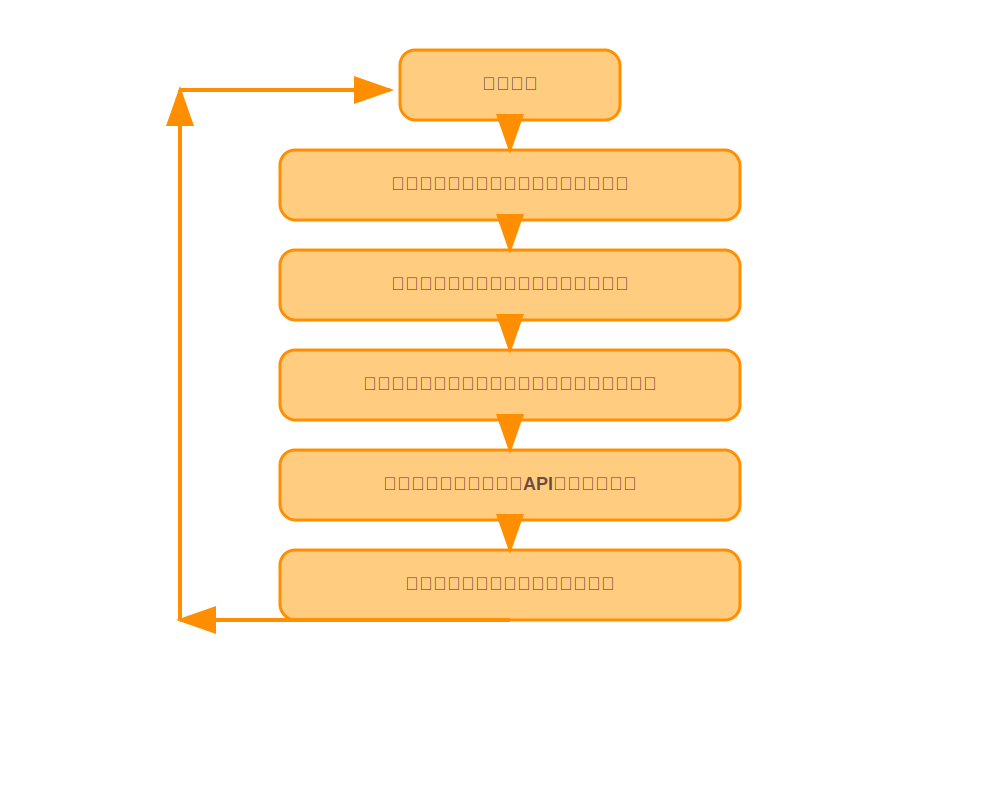

## 监督学习

监督学习（Supervised Learning）是机器学习中一种重要的**学习范式**，其核心思想是通过已知的输入-输出对（训练数据）来训练模型，使其能够对新的、未见过的输入进行准确的预测或分类。

这种学习方式的特点在于训练数据中每个样本都包含明确的标签或期望输出值，这些标签被称为“监督信号”，用于指导模型的学习过程。

## 监督学习定义

**定义**：监督学习是一种通过已知输入-输出对训练模型的方法，目标是找到一个映射函数f:X→Y，使得模型能够根据输入X 预测出相应的输出Y。

**输入与输出**：输入通常是一个向量（特征），而输出是一个标签或期望值。例如，在分类任务中，输出是一个离散的类别标签；在回归任务中，输出是一个连续的数值。

## 训练过程

1. **数据准备**：收集并标注训练数据，这些数据通常由人工标注或实际观测得到。
2. **模型训练**：通过调整模型参数，使模型能够拟合训练数据中的输入-输出关系。常见的优化目标是最小化预测值与实际值之间的误差。
3. **模型评估**：使用测试数据评估模型的性能，确保模型在未见过的数据上也能表现良好

*监督学习模型训练流程示意图，展示了从输入数据到模型训练的完整过程*

## 监督学习分类

监督学习广泛应用于各种实际问题中，包括但不限于：

### 分类任务

垃圾邮件检测、图像分类、语音识别等。这些任务的目标是将输入数据映射到离散的类别标签。

### 结构化输出

预测复杂的结构化输出，如序列标注。

### **回归任务**

如房价预测、股票价格预测等。这些任务的目标是预测一个连续的数值输出

### **异常检测**

如信用卡欺诈检测、设备故障预测等。这些任务的目标是识别不符合正常模式的数据

## 监督学习的挑战与局限性

- **数据标注成本高**：标注数据需要大量的人力和时间投入，尤其是在复杂任务中
- **过拟合风险**：如果模型过于复杂，可能会在训练数据上表现很好，但在新数据上表现不佳
- **对噪声敏感**：训练数据中的噪声可能会影响模型的性能