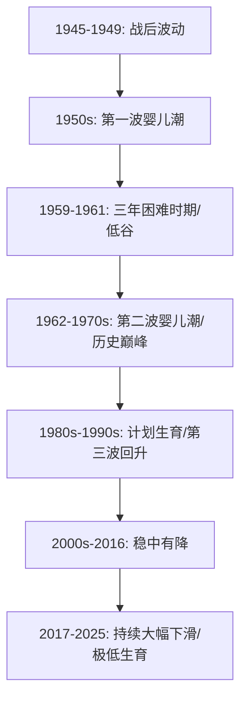

> 2025年，中国出生人口792万，创下建国以来最低记录。总和生育率降至1.09，远低于通常认为的2.1世代更替水平，也显著低于1.5这一公认的“高度警戒线”。
> 身处其中，感觉未来国家必经将来剧烈的变化。会发生什么，如何应对？

## 中国人口情况整理

2025年中国人口情况整理如下：

| 指标类别	| 2025年统计数值	| 历史坐标及趋势意义 |
| --- | --- | --- |
| 全年出生人口	| 792万人	| 1949年以来新低，等同于1738年乾隆时期水平 |
| 全年死亡人口	| 1,131万人	| 1968年以来最高死亡率 |
| 人口自然增长率	| -2.41‰	| 负增长显著加速 |
| 总和生育率 (TFR)	| 约 1.09	|步入“极低生育率陷阱”，接近全球最低 |
| 60岁及以上人口	| 32,338万人	| 占总人口23%，步入深度老龄化社会 |
| 16—59岁劳动人口	| 85,136万人	| 总量持续萎缩，且面临结构性技能错配 |

根据当前数据和中国退休政策，预期中国人口结构如下：

| 指标                 | 2030年           | 2035年          | 2040年          | 注释                          |
| ------------------ | ------------- | ------------- | ------------- | --------------------------- |
| **总人口**            | ≈ 13.6–13.9 亿 | ≈ 13.3–13.7 亿 | ≈ 13.1–13.6 亿 | 稳步下降趋势延续。([搜狐][1])          |
| **0–14岁少儿占比**      | ≈ 12–14%      | ≈ 10–12%      | ≈ 9–11%    | 少儿人口比例持续下降。([fjlib.net][2]) |
| **15–59岁劳动年龄人口占比** | ≈ 55–58%      | ≈ 50–53%      | ≈ 48–51%     | 劳动权益人口规模缩小。([fjlib.net][2]) |
| **60岁及以上老年人口占比**   | ≈ 24–26%      | ≈ 28–30%      | ≈ 30–32%    | 老年人口继续上升。([搜狐][1])          |
| **65岁及以上人口占比**     | ≈ 18–19%      |≈ 22–23% | ≈ 26%  | 高龄人口增加。([fjlib.net][2])     |

[1]: https://www.sohu.com/a/951700646_121124833?utm_source=chatgpt.com "中国人口形势报告：2025_生育_老龄化_政策"
[2]: https://www.fjlib.net/zt/fjstsgjcxx/msgc/202111/t20211130_468742.htm?utm_source=chatgpt.com "中国人口老龄化趋势的经济社会影响及公共政策应对_民生观察_福建省图书馆"

相较于日韩，我们国家出现的典型特征是“未富先老”。日本深度老龄化出现在人均GDP 4万美金，韩国进入深度老龄化时人均GDP 3万美金；中国(当前)进入深度老龄化人均GDP 1.2-1.3万美金。

这意味着中国的养老体系尚未完善时，就在快速进入老龄化社会。更意味着，该情况会对中国医疗、养老、教育等社会福利体系带来巨大压力。制度设计、财政负担与经济转型带来了更大的挑战。

## 社会宏观影响

### 劳动力市场结构变化

15-64岁劳动年龄人口的加速减少是2025年后最显著的特征之一。预计在2025-2050年间，我国劳动人口规模将减少约2.5亿，年均减少近1000万 。   

从“人口红利”到“人才红利”： 虽然数量在减少，但人口素质在持续提升。2025年16-59岁人口平均受教育年限达到11.3年 。这预示着社会必须从低端制造业向高增值的技术密集型产业转型。

人均素质的提升与整体劳动力的减少会引发什么样的变化？

**1.“就业难”与“招工难”并存。**

2015-2024年，中国大学生毕业人数从749万一路攀升至1179万，大学生就业难已经成为社会共识。另一方面，劳动力整体的减少，招工难也成为社会共识。

一个典型的场景是，蓝领薪资在不断拉高，但仍然存在缺口，外卖人员的人均学历已经是本科。外卖小哥的才艺表演不断刷新社会对外卖人员学历低、能力差的刻板印象。

**2.技能错位，必然会推动 再培训需求爆发。**

可以预期到，校园教育 与 市场需求间将存在长期的技能错位。这必然推动在培训市场需求的爆发。校企合作、企业与培训机构合作毕竟越来越紧密。

该周期内的个体必须做好顺应时代变化，不断学习，推动个人技能转型的准备。

**3.整体劳动力减少会推动自动化与机器人密度激增。**

研究发现，劳动力越稀缺的国家，机器人安装密度越高。德国和日本由于人口更老，其工业机器人密度显著高于美国。

重复性、常规性的岗位（如出纳、行政助理、简单制造）将快速消失；而人工智能、大数据、可再生能源和环境工程等领域的专业需求将持续上升。

**4.“超级个体”与灵活用工的常态化。**

高素质个体不再依赖于大型组织，而是通过技术工具实现个人能力的杠杆化。新一代高素质职场人更看重自我实现和工作幸福感，而非单纯的谋生。

这推动了“适己职场”的兴起，强调灵活的工作模式和人性化管理。灵活用工正从传统的零售、物流行业，向金融、医疗、算法工程等知识密集型领域渗透，产生大量“超级个体”。

所有的这些因素会推动社会财富分配的进一步分化。具备分析思维、认知技能和领导力的非常规劳动者将从技术进步中获得超额收益。AI和自动化的所有者与高级使用者将占据更大利润份额，而无法完成技能升级的群体可能面临收入停滞，导致社会贫富差距进一步显现。

### 银发经济 成为长周期内的朝阳产业

2025年，中国60岁及以上的老年人口已达3.23亿，占比23% 。这种深度老龄化正深刻改变财政支出结构。

* “第六险”的刚性确立： 长期护理保险（LTCI）在2025年已覆盖约3亿人。随着失能老人预计在2050年达到6200万，长期护理支出规模可能在届时达到1.7万亿元 。   
* 适老化基建的欠账与补课： 城镇化率达到67.89%后，城市社区的适老化改造、适老智慧金融服务以及专业护理人才的培养（缺口超500万）成为新的经济增长点 。

3.3 行业格局的非对称震荡
不同行业对人口缩减的敏感度各异，形成了一场大规模的存量洗牌。
|受影响行业|2025-2030年演变逻辑|关键风险与机遇|
|--------------|----------------------------|-------------------|
|母婴与K12教育|需求基数持续萎缩，行业进入极端内卷与高端化转型。|幼儿园关停转增，学校从“工厂模式”转向“精致化小班” 。|
|房地产市场|总量需求见顶。人口流向核心都市圈（长三角、珠三角）的特征加剧。|一线城市核心区保持韧性，非省会地级市面临长期阴跌 。|
|制造业|劳动力短缺迫使企业通过AI和机器人重塑供应链。|绿色产业（氢能、核聚变）、低空经济成为新的用工高地 。|
|社会服务业|护理、康复治疗、心理健康等生活性服务业需求激增。|2025年养老看护行业职位增速高达29.2% 。|

## 对个人的启发

### 职业发展

拥抱“银发红利”： 养老服务不再是传统的“保姆工作”，而是涵盖康复管理、智慧适老技术、养老金融咨询的高端服务领域 。

掌握“AI协同”技能： 数字硬技能将与专业领域知识结合，形成“数字+X”的综合竞争力。具备跨界协同能力和“人机协作”能力的人才，将在自动化浪潮中获得更高的议价权 。

关注“出海”机遇： 随着国内人口见顶，领先的制造业企业（如工程机械、新能源）正加速产业链全球化配置。具备国际视野和跨文化管理能力的员工将成为稀缺资源 。

### 财富积累逻辑的“去地产化”与“长寿化”

在人口负增长时代，资产配置必须考虑“人口密度”和“长寿风险”。

房产投资的审慎选择： 只有具备强虹吸能力的核心城市（如上海、深圳、成都、杭州等）房产才具备资产属性 。普通地级市的房产可能逐渐回归其“纯消费品”本质。   

构建“长护保障”体系： 个体应对长寿风险的工具应从单一的养老金转向 **“基本养老+商业保险+长期护理保险”的多维组合** 。鉴于基本长护险主要针对重度失能，中轻度失能和痴呆的护理保障需要个体通过私营市场提前储备 。   

**投资于“自身健康”**： 在“10个人养4.8个人”的时代，保持健康的劳动能力是应对社会抚养比失衡最有效的个人防御策略 。

### 家庭结构的“单点支撑”与社交重构

传统的血缘互助功能在2025年的中国社会正面临解体。

**“孤岛社会”的挑战** ： 独生子女面临的“4-2-1”压力已显性化。个体需重新审视家庭资源分配，并锁定社区化、社会化的养老资源（如优先入住权） 。   

**建立非血缘互助网** ： 随着丁克家庭和独居者的增加，个体需要有意识地通过行业协会、邻里社区或志同道合的兴趣团体，构建“契约式”而非“血缘式”的支撑网络。

